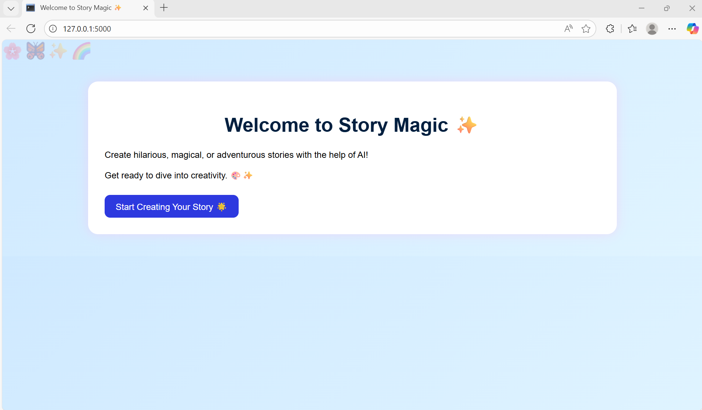
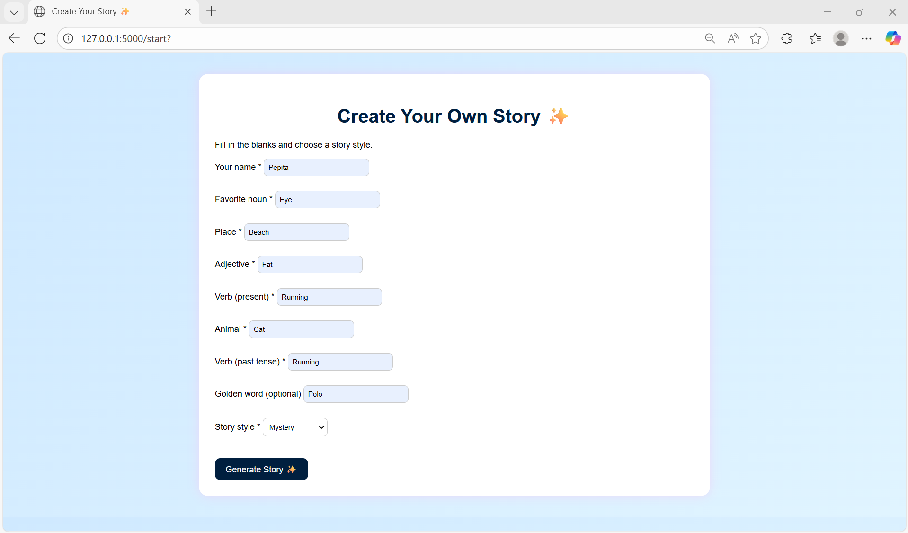
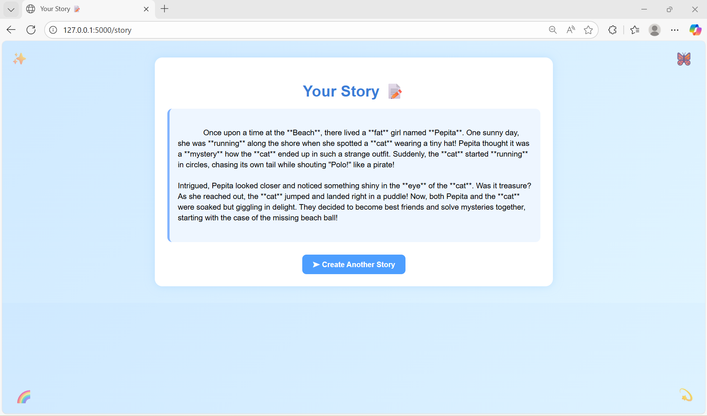
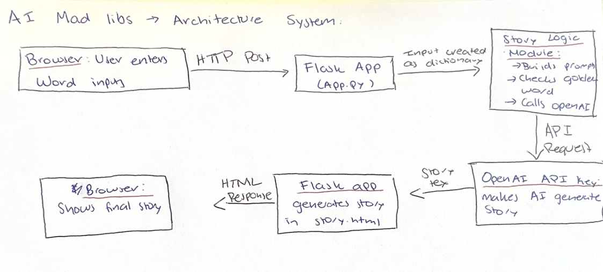
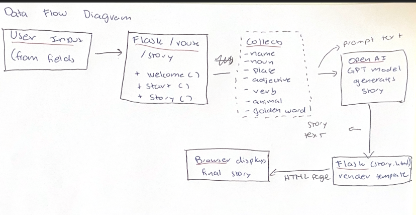
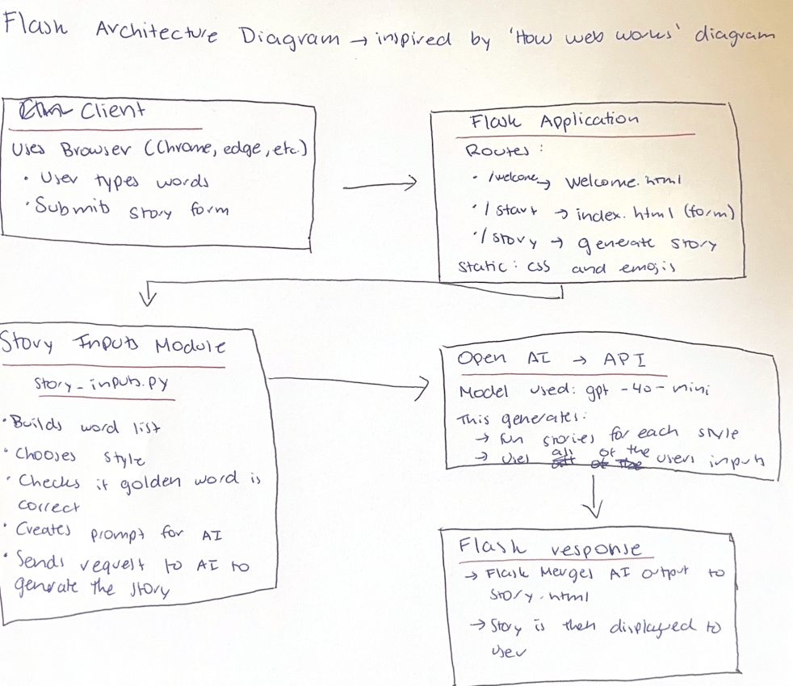

# Final Project - Lucia & Nicole
This is the final project for OIM3640

Project Members: 
    1. Lucia Prado 
    2. Nicole Gaige 

1. The main idea or goal for our project was to create a cretive, interactive and engaging experience by creating an AI style Mad libs story. This was a game we both used to play when we were little with our friends, however, the original game relied on fixed templates which cause the stories to repeat themselves after a certain amount of tries. Therefore, we decided to do this, as the idea of including OpenAI API would allow us to expand the game further and provide new, different stories every single time based on the style the user chooses. This allows our webpage to provide a more humerous, myesterious or romantic story that changes every single time and provides a personalized story to the inputs of the user. 

Our main goal was to create a webpage were users (mainly children as this is a childrens game, but also anyone that wants to participate), can type in random words they think of following the prompts, and receive instantly a unique AI story tailored to their inputs. This allows the story to be constantly evolving, compared to the previous game that used the fixed templates every single time and the only thing that changed where the inputs given by the user. This adds an element of surprise and enjoyment for the user as the can repeat the same style multiple times and get different stories so that the fun can continue!

Example run: 
- As shown on the first image, once you click on the link it takes you to a Welcome page, where there are blinking emojis, a fun backround and a brief description of what the game does. Then you click the button 'Start creating your Story' which will take you to the main page. 

- After pressing the button, you are taken to the main webpage which introduces you to all of the input options. These being: Your name, noun, place, adjective, present and past tense verb, animal, golden word and story style. The story style is a drop down feature tha include several story styles to offer more alternatives to the user, these options are: adventure, mystery, fairy tale and silly. Finally the 'golden word' option, is an option we give users to try and find a golden word. This is a specific word we selected and if the user guesses right they unlock a new portal where they are deemed the 'Ultimate Adventurer' and offer kind of a winning recognition to the game. If the user inputs a word but doesn't guess the specific word, the AI model just runs a normal story like it does usually an no error message will appear. After typing all of the inputs and selecting the story style, the user can press the 'Generate Story' button which will create the final story. 

- Finally, the user is taken to the result page, where it presents a title of 'Yout Story' and the user can see the AI generated story that includes all of the inputs the user gave in the previous section. And this is how users can play our game. It is supposed to be a playful, interactive an fun experience, allowing the user to learn, experiment and have fun. This was really fun experience we had while implementing programming tools we learned throughout the semester such as Flask, API Keys and prompt engeneering. 

2. To acess, download and install our software please follow the next steps. 
- 1. First you need to download our project. To do this go to the Github page and clone the repository of Final-Project---Lucia---Nicole. You can also type ' git clone https://github.com/ngaige/Final-Project---Lucia---Nicole'. 
- 2. After this you need to make sure that all the Python dependencies we used in our code are installed. Therefore, you can go to Command Prompt and type 'pip install -r requirements.txt' which will ensure that you have everything installed and everything will work when you run the project. 
- 3. Set up your OpenAI API key. You need to create a .env file and add your OpenAI key. Set up within the file as 'OPENAI_API_KEY = ..." and place yout key there. Do not upload .env file in Github as it will leak the API key and then it won't work anymore. 
- 4. Finally to access the webpage you just run the application. To do this runn app.py in python and in the terminal it should appear a line that says '* Running on http://127.0.0.1:5000'. Click that link and it should take you to the webpage. After this, you are able to use the Webpage and follow the process of the Example Run given in the previous question and then you can get to read your own personalized AI generated story file. If there are any troubleshooting errors, such as stories not generating, flask server errors or HTML formatting looking wrong; I would suggest looking through the API Key, make sure all the dependencies are installed and refresh the webpage server to make sure it continues to work. 

3. These are the diagrams that best describe our project: 

4.  Results : Our final project was able to present a customized story that can be generated through different OpenAI API. Basically, the generation of the stories all depend on the words that are entered by the user. Once the inputs are submitted by the user, the system produces a whole story ona. different area. There is a Surprise Me button that filld random inputs.

5. Project Evolution 
The project evolved constantly ever since we first started working on it. For example, in the beginning, our program could only accept text inputs and would print basic stories on one single area. As we continued testing different ways to create it and be more creative, we realized that our project should have a more interactive experience. Due to this, we redesigned the interface and create a new style, full of a color, emogis and specific feautures such as the dropdown menu. Also, we made sure that the story, once created, would take users to another area. 
Another evolution was the usage of the OpenAI API. At first, we were experiencing issues with the API key, as it was not loading correctly and it would directly and constantly give us errors. After debugging, we were able to fix the code completely and make sure the key was working. 

6. Attribution: Throughout the project we used an OpenAI API key to generate and create the story. We started the project by using a sample code from the class and later changed it to more of what our project was going to look like. The OpenAI documentation was  another resource that we used that was very helpful especially when we were having the API issues. Aside from the resources mentioned, the programming and the feautures created were done as a team. 